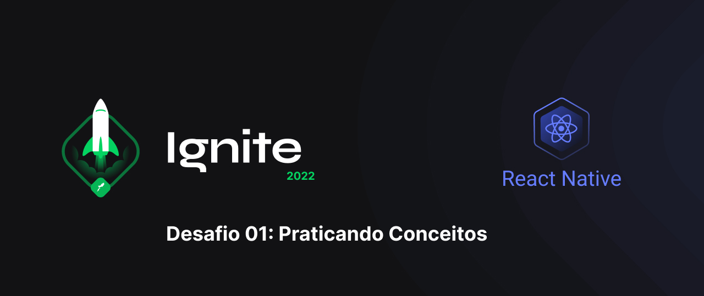

This repository contains the resolution of 1th project: Practicing Concepts from the react native course by rocketseat. The application allows the user to add tasks or reminders of tasks to be completed, having the option of removing them or marking them as complete.

    
    

