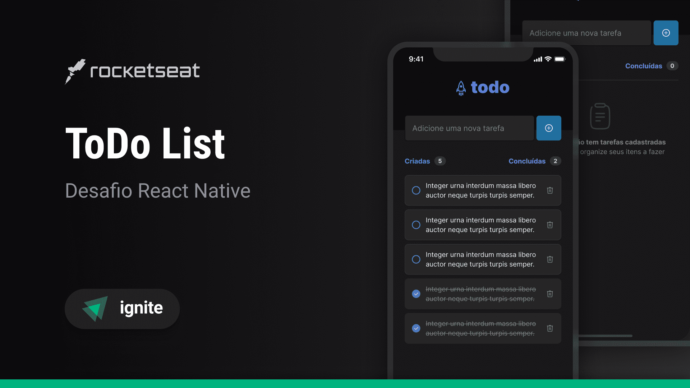

## Sobre o projeto

ToDo List permite ao usuário adicionar tarefas ou lembretes de tarefas a serem concluídas, tendo a opção de removê-las ou marcá-las como concluídas.

<div align="center">
    
    
</div>

## 🛠 Tecnologias

As seguintes ferramentas foram usadas na construção do projeto:

- [Expo](https://expo.io/)
- [React Native](https://reactnative.dev/)
- [TypeScript](https://www.typescriptlang.org/)

## Features

- [x] Cadastro de tasks
- [x] Exclusão de taks
- [x] Marcar task como concluida

## Pré-requisitos

Antes de começar, você vai precisar ter instalado em sua máquina as seguintes ferramentas:
[Git](https://git-scm.com), [Node.js e npm](https://nodejs.org/en/).

Além disto é bom ter um editor para trabalhar com o código como [VSCode](https://code.visualstudio.com/), e um emulador ou aparelho com o Expo Go instalado.

### Executando o aplicativo

```bash
# Clone este repositório
$ git clone https://github.com/gustavosorati/todo-list

# Vá para a pasta server
$ npm install

# Instale as dependências
$ npx expo start
```